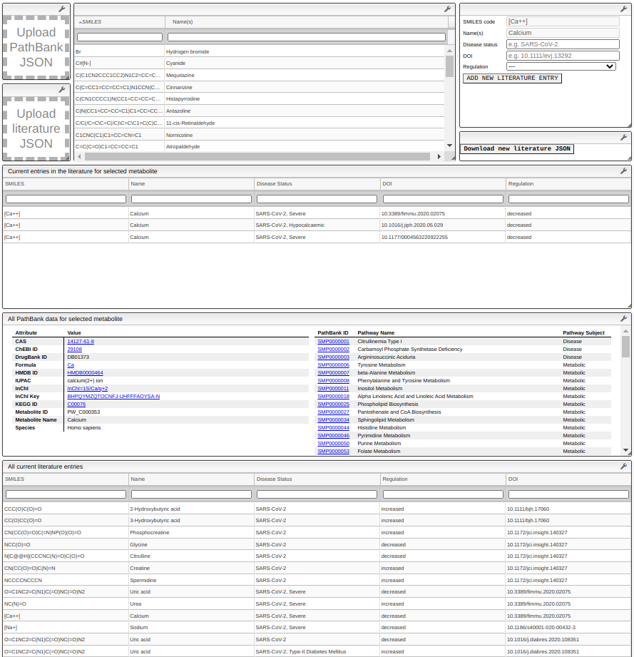

# JSON of literature search results
#### Mr. George L. Malone
#### 15<sup>th</sup> of March, 2021

This repository contains the contents of the code executor cells in a ChemInfo
view for viewing and adding to a JSON of details of significantly dysregulated
metabolites under SARS-CoV-2 disease status, as found in scientific literature
within a specific category or set of categories.  The purpose of storing the
active code here is for improved version control, and for better exposure of
the developed code.

A large JSON containing data extracted from PathBank is used for adding to the
literature search results.  This is used to permit greater control of certain
identifying features of the metabolites entered, as a previous attempt to
curate some literature information lacked rigour, resulting in jumping through
many hoops to attempt to find and identify correct data (see
[glm729/d3fdg](https://github.com/glm729/d3fdg)).  Thus, this should solve the
problem, in a way, by starting again and eliminating one of the root problems
with the originally requested project specifications.

This work is also a partial spin-off of an attempt to aggregate certain curated
chemical data.  Work on the aggregator is ongoing, and may be provided on
GitHub in future.


#### Current capabilities

In its current state, the view in ChemInfo is able to display all data present
in the PathBank and literature JSON files.  The PathBank data are displayed in
a generated HTML table (see [`showPathbankData.js`](showPathbankData.js)), and
the literature data are displayed in Slick Grid modules (which appear to be an
implementation of [this library](https://slickgrid.net/)).  When clicking a row
in the literature data, any information in the literature for the clicked
chemical is displayed, as well as a tabular form for the user to add further
data to the literature JSON if desired.  If new data are added, the user is
prompted (i.e. a button is displayed) to download the new/augmented file.

Below is a screenshot (at 2/3 zoom) of the view in its current state.  The
visual structure of the view is relatively rudimentary at this stage, e.g.
module boundaries are not hidden, buttons are not properly aligned.  This will
likely be improved as the view is developed.




#### Excluded data

Two cells, for reading in the PathBank JSON and the literature JSON, are two
lines each, so these have been excluded.  They are literally of the form:

```javascript
let data = API.getData("jsonName").resurrect();
API.createData("dataName", data);
```

where `name` is used here as a placeholder.  The initial entry in the
literature JSON is also excluded, as this is a bit boring and might be a bit
too much clutter (but can be uploaded if of interest, it doesn't contain
confidential data).

The PathBank JSON is excluded, mainly because it is 172MB, but also because I
do not own the data -- the original dataset can be found
[here](https://pathbank.org/downloads), and is the second entry in the list
(_Metabolite names linked to PathBank pathways CSV_).  A description of the
reduction process from the original 1.2GB CSV to the 172MB JSON will be
described in another repository, which is as yet not prepared.
